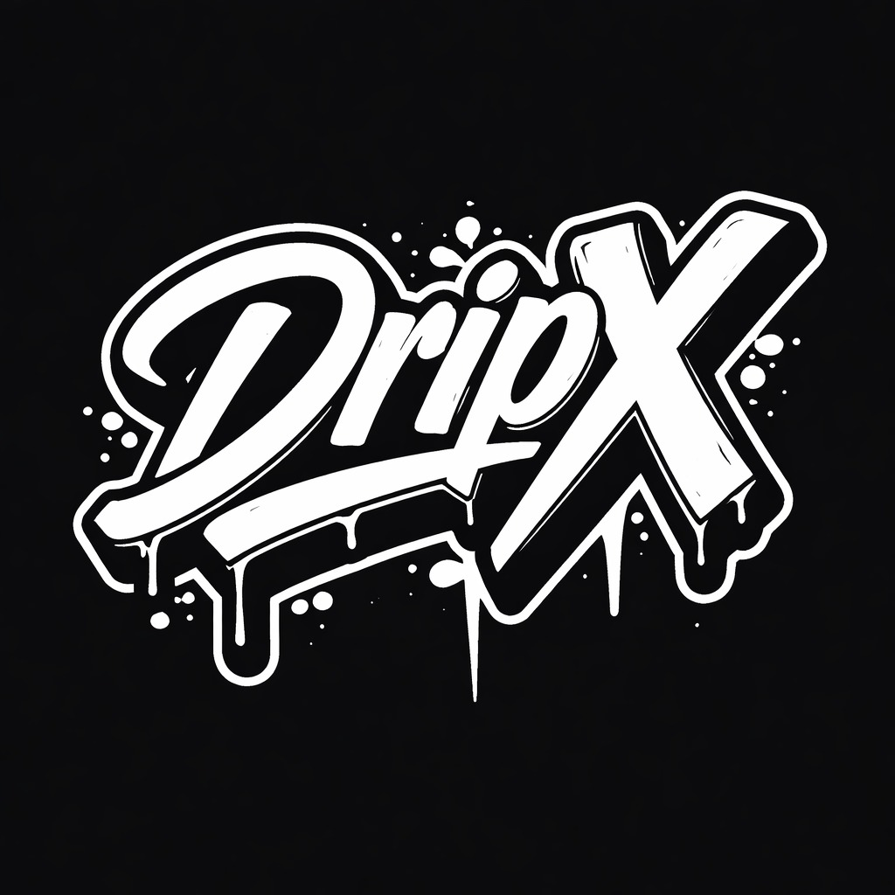

# DripX Fragrance — Premium perfume catalog with old-school hip-hop identity

> **Your scent. Your street. Your story.**

DripX is a single-file, production-ready perfume catalog with a raw, unapologetic old-school hip-hop identity — graffiti textures, gold-chain accents and spray-paint energy, executed with restraint so it reads premium, not costume. Designer, Niche and Arabic fragrances, priced in Costa Rican colón (₡).



## Features

- **30-product catalog** — Designer (10), Niche (10), Arabic (10), each with full olfactory data.
- **Bilingual ES / EN** — full UI + product descriptions, persisted to `localStorage`. The tagline always stays in English.
- **Product modal** — olfactory pyramid, intensity meter (`LIGHT → BEAST MODE`), longevity & sillage dot ratings, occasion / season tags, volume (50 / 100 ml) & quantity selectors.
- **Cart drawer** — slide-in cart with quantity controls and **WhatsApp checkout** (formatted order message).
- **Special Orders (Encargos)** — sourcing request form that pings the owner on WhatsApp.
- **Admin panel** — full CRUD over products + WhatsApp config. Open via `#admin` or **triple-click the footer logo**. Password: `dripx2024`.
- **Supabase-backed, localStorage-safe** — reads/writes the `perfumes` table, gracefully falls back to a local cache and a hardcoded seed if Supabase is unavailable.
- **Branded SVG bottles** — every product renders a category-styled bottle placeholder, so the catalog never shows a broken image. Real photo URLs (or uploads) override it.
- **Motion** — GSAP + ScrollTrigger hero reveal, staggered card entrances, filter transitions, drawer & modal animation. CSS-only hover states and a pulsing WhatsApp FAB.

## Tech stack

- Single `index.html` — all CSS & JS inline. No build step, no framework.
- [GSAP](https://gsap.com/) + ScrollTrigger (CDN)
- [Supabase JS](https://supabase.com/) (CDN)
- Google Fonts: **Bebas Neue**, **Permanent Marker**, **DM Sans**
- Vanilla HTML5 / CSS3 / ES6+

## Configuration (before going live)

Open `index.html` and set these near the top of the `<script>` block:

| Constant | What to set |
| --- | --- |
| `SUPABASE_ANON_KEY` | The DripX Supabase project anon key (different project than LuisBlades). |
| `DEFAULT_WHATSAPP` | The store WhatsApp number, digits only with country code (e.g. `50688887777`). Also editable in the admin **Settings** tab. |

### Supabase `perfumes` table

Suggested columns: `id (text, pk)`, `name`, `brand`, `category`, `price_crc (int)`, `description_es`, `description_en`, `top_notes (text[])`, `heart_notes (text[])`, `base_notes (text[])`, `family`, `intensity (int)`, `longevity (int)`, `sillage (int)`, `occasions (text[])`, `seasons (text[])`, `image_url`, `in_stock (bool)`, `limited (bool)`.

## Local development

It's a static file — just open `index.html`, or serve the folder:

```bash
npx serve .
# or
python -m http.server
```

## Deployment

Hosted on **Netlify** (`publish = "."`, see `netlify.toml`). Push to `main` to deploy.

```bash
git push origin main
```

---

© DripX. All rights reserved. Stay dripping.
